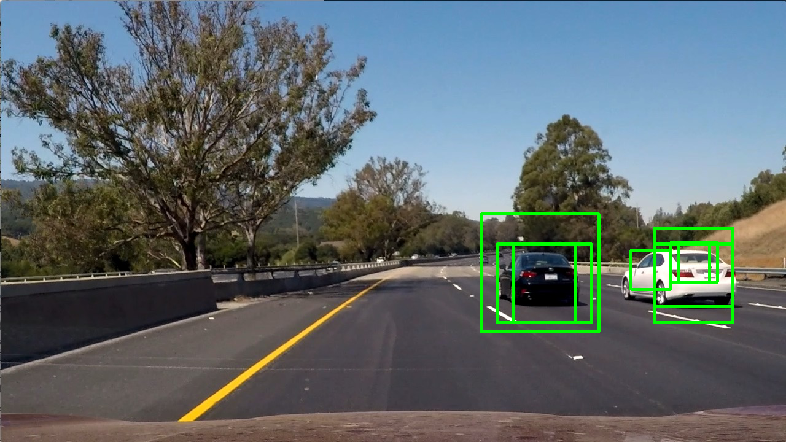
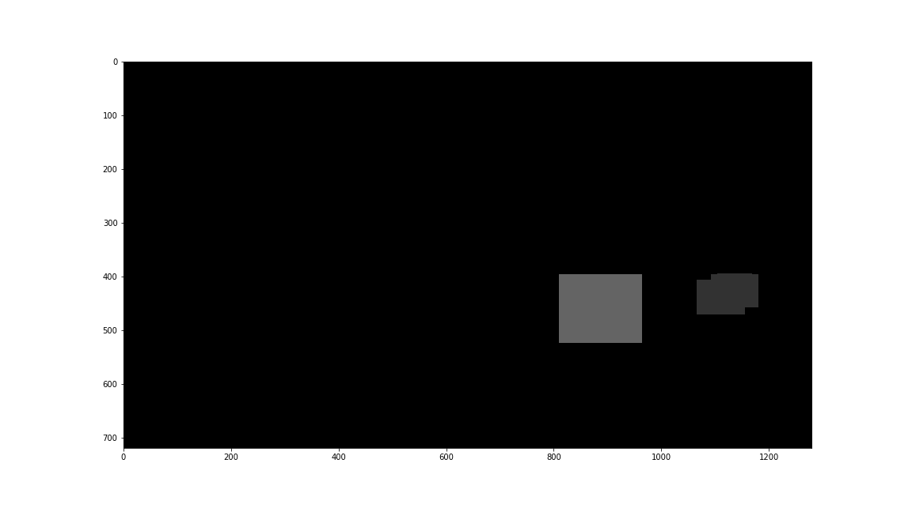

## Vehicle Detection Project

All code in this project is in `main.py`.

### Histogram of Oriented Gradients (HOG)

#### 1. Extracted HOG features from the training images.

The code for extracting HOG feature is in the function `extract_features()` and `get_training_feature()`. I use only the Y channel of the `YCrCb` color space and HOG parameters of `orientations=6`, `pixels_per_cell=(16, 16)` and `cells_per_block=(2, 2)`.

#### 2. Choice of HOG parameters.

Initially, I use the parameters `orientations=9`, `pixels_per_cell=(8, 8)` and `cells_per_block=(2, 2)`. The resulting feature vector has 1764 dimensions. The test validation accuracy of linear SVM is 0.92. However, the test accuracy on the image in the "test_images" folder is only about 0.8. Because there are lighting and quality differences between the training data and the test images, I lower the dimension of the HOG feature to reduce overfitting of the training data.

Finally, I use `orientations=6`, `pixels_per_cell=(16, 16)` and `cells_per_block=(2, 2)`. The validation accuracy increases to 0.95 and test accuracy increases to 0.9.

#### 3. Training model

I use the linear SVM model with the default `C = 1`. One important problem is that the test bounding boxes are mostly no car but the training data has equal amount of car and no car images. To address this issue, I flip every no car training image and also add additional no car patches. This helps reduce false positive rate.

### Sliding Window Search

#### Sliding window proposal
For a given window size, I compute the minimum and maximum y positions that may contain a car. I assume that a car must be wider than half of the lane width and narrower than the lane width. Therefore, given the expected car width I can calculate the min and max of y position based on the lane. The following images shows various sizes of window proposal.

#### 2. Show some examples of test images to demonstrate how your pipeline is working.  What did you do to optimize the performance of your classifier?

The following images shows the remaining bounding boxes that the classifier says there is a car in it.

There are some false positive and the location of the boxes are not perfect. However, after using the heat map and thresholding method to aggregate the bounding boxes (as shown in the figure below), we can identify the two cars.

#### heatmap

#### labels

#### result

---

### Video Implementation

Here's a [link to my video result](./heat10_decay0.75_initheat0_project_video.mp4)

To further eliminate false positives, I aggregate the heat map of current frame with past frames using exponential sum with decay rate of 0.75. However, the side effect is that the location of the bounding box becomes less accurate.

---

### Discussion
The most difficult part is the image difference between the training data and the testing video. Although the validation accuracy is over 0.95, the model still generates some false positives that are tricky to remove. I would like to try neural network model in future work.
